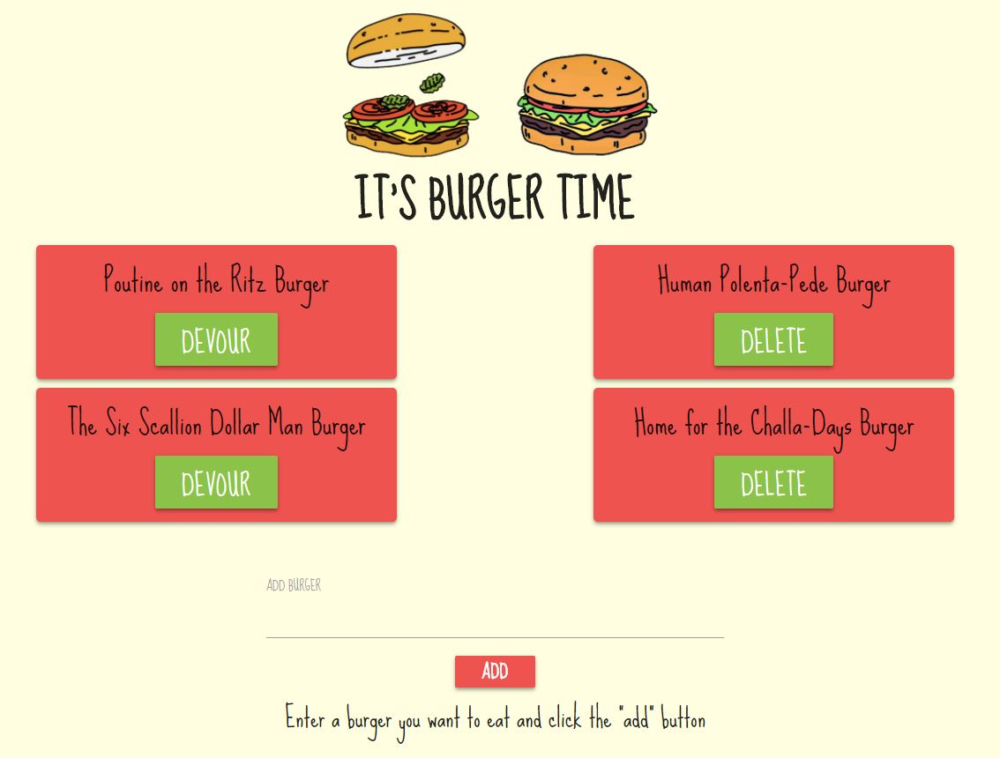

# It's Burger Time

* In this app, the user can add new, devour, or delete burgers.

* The burgers are held in a mySQL database that contains an id, the burger name, and whether or not the burger has been devoured. The devoured column is a boolean with a default of false. 

* The left side of the page holds the burgers that have been newly created and/or not yet devoured. 

* If the user clicks DEVOUR, the burger will move from the left to the right column, and will have a button with the capability of deleting.

* At the bottom of the page, the user can add any type of burger they want, and when the user clicks ADD, the burger will be added to the database and will appear in the left column of the page. 